# Astro Contenful POC

A POC explaining how to work with Contentful and Astro.

## Contentful

All copy screens how setup Contentful

1. Create `fds-astro-space`

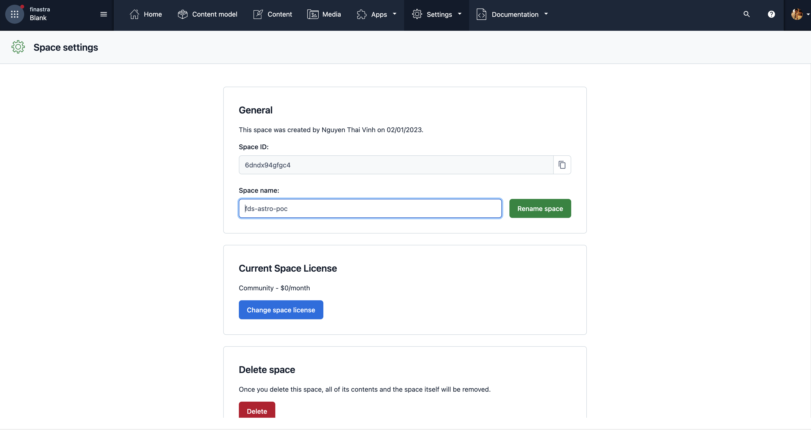

2. Create POC content model

- Design Token

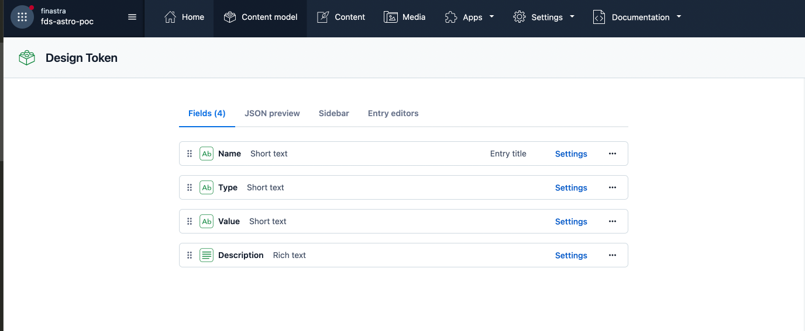

- Foundation Entries

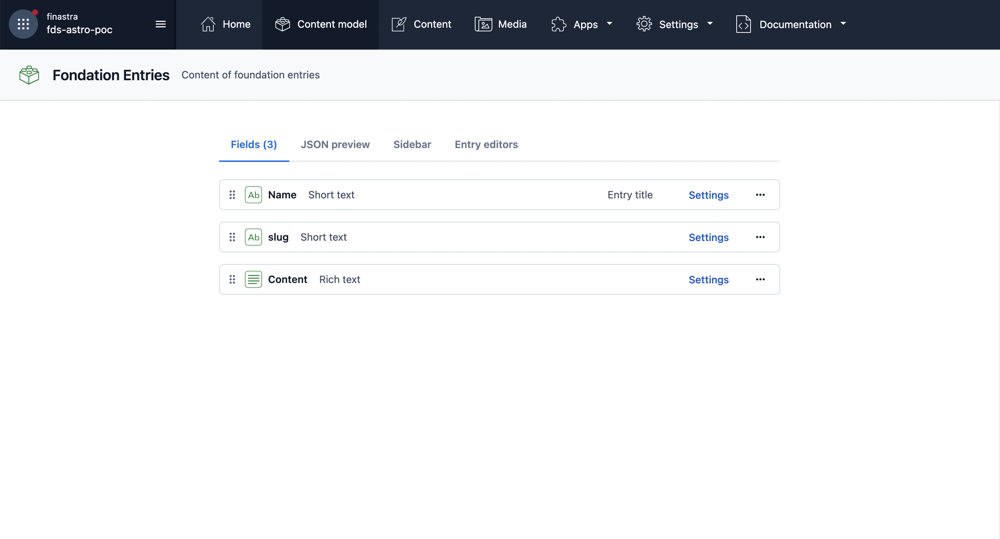

- Foundations

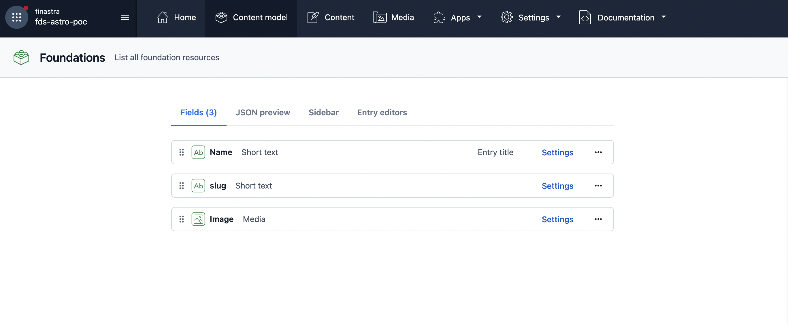

3. Create A POC Content

- Design Token Content

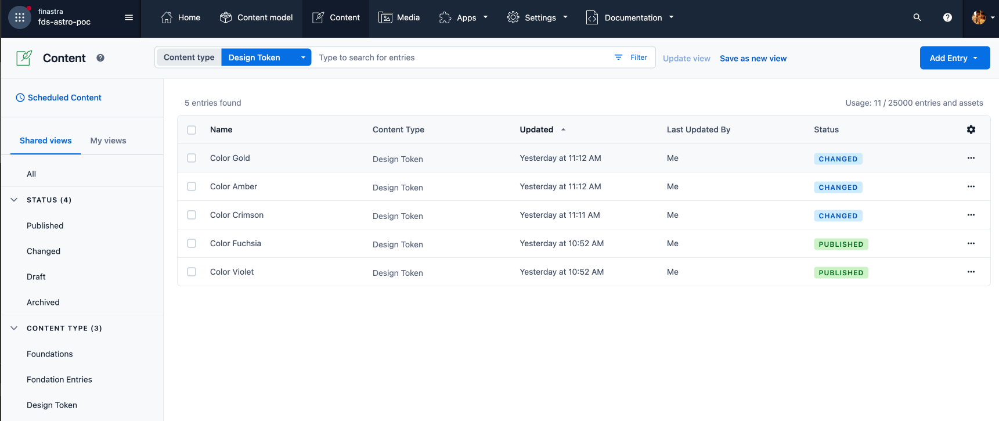

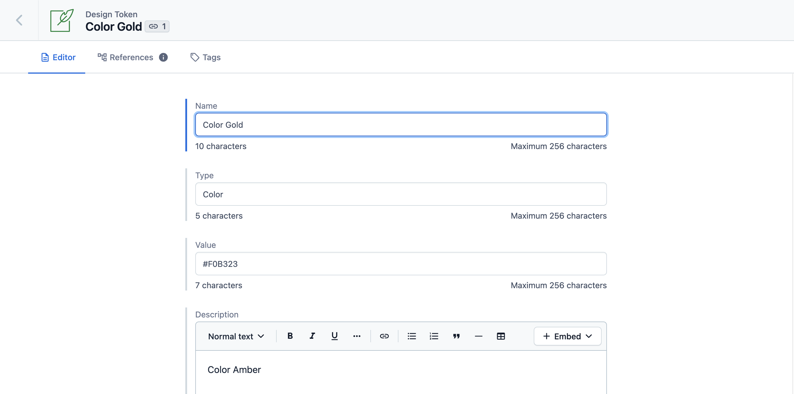

- Foundation Content

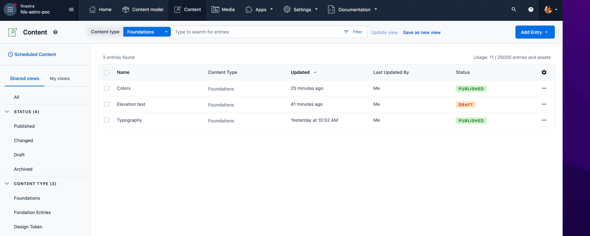

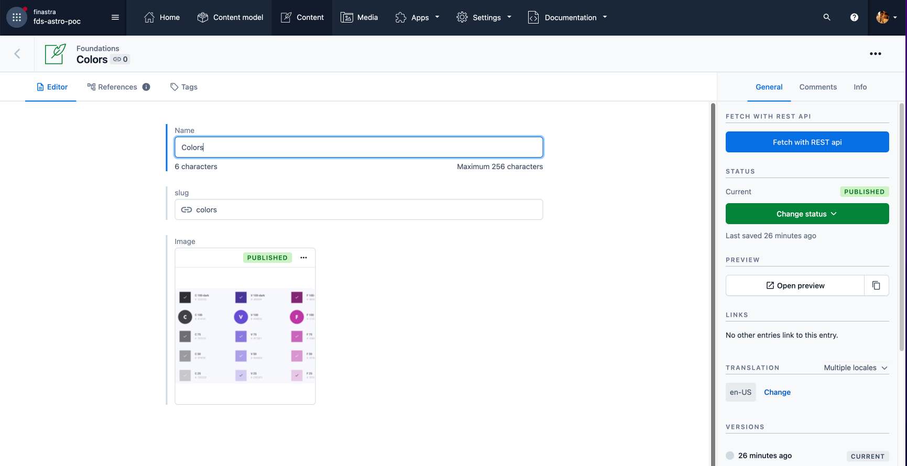

- Foundation entries content

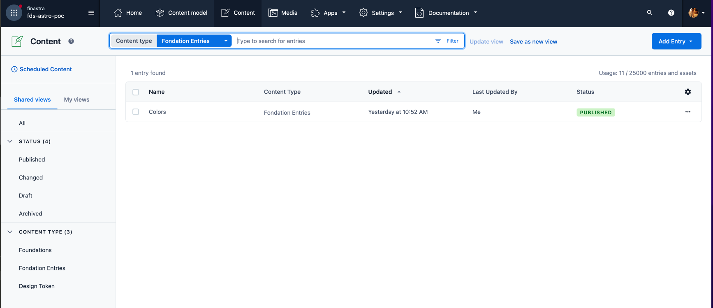

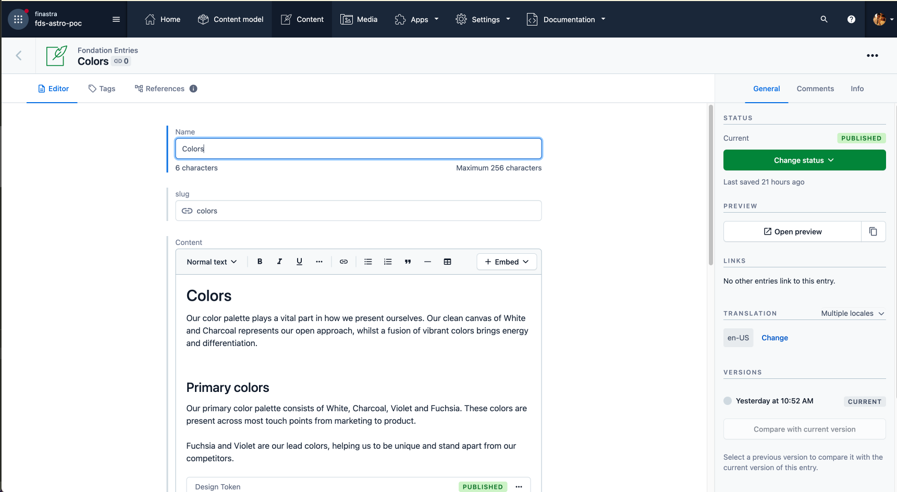

4. Setup contentful credentials (This is need for setting up Dev Env)

- Contentful space ID - The ID of your Contentful space.

- Contentful delivery access token - The access token to consume published content from your Contentful space.

- Contentful preview access token - The access token to consume unpublished content from your Contentful space.

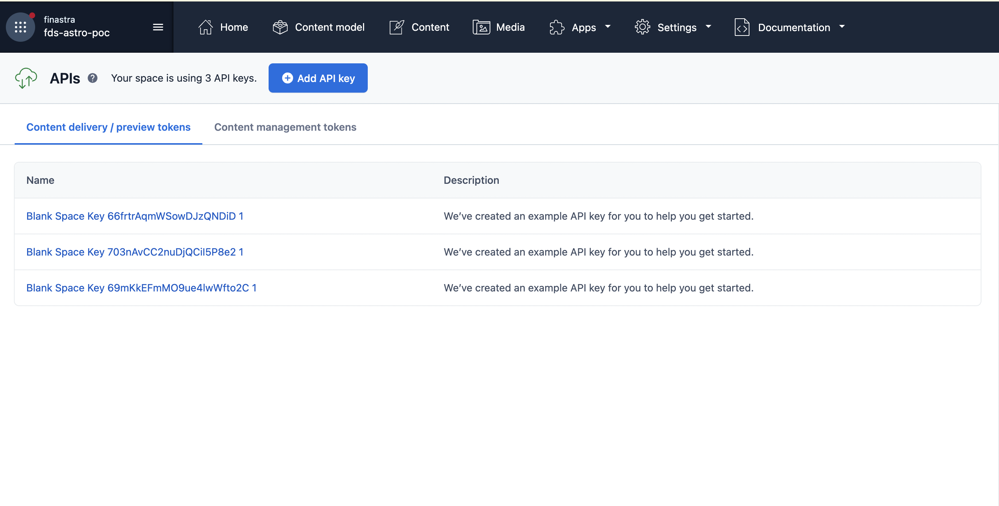

5. Setup Preview URL

- Go to Content Preview Menu

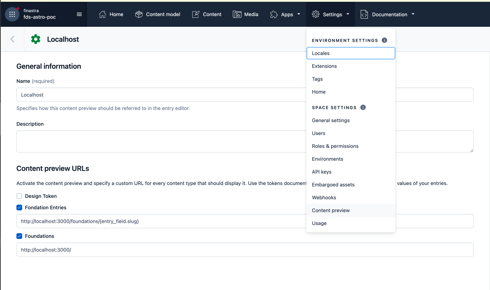

- Create a content Preview setup

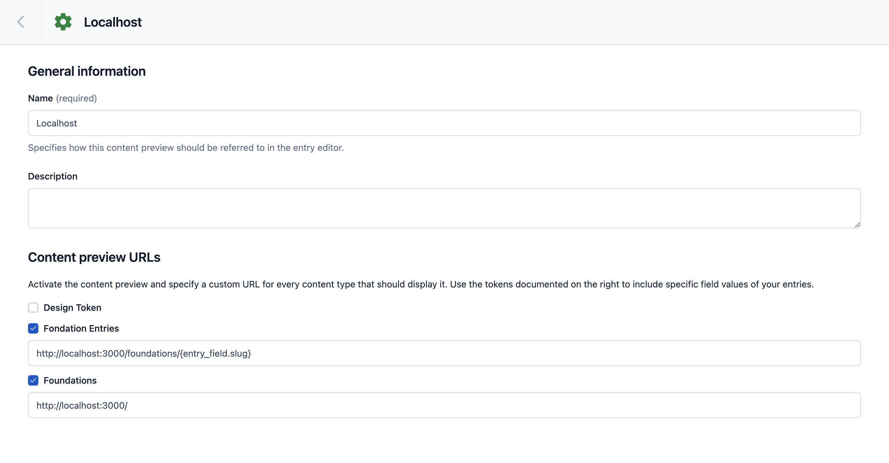

## Astro

This POC contains a astro implementation and configuration with folowing feature

- Contenful integration
- Lit integration
- SSR

### Local dev

1. setup .env

```
CONTENTFUL_SPACE_ID=...
CONTENTFUL_DELIVERY_TOKEN=...
CONTENTFUL_PREVIEW_TOKEN=...
```

2. Install dependencies

```
npm installl
```

3. Start Dev Server

```
npm start
```

### Deploy

- This POC prepares two npm script to deploy to server. Because it needs SSR, so it will need a node server.

- The entry server file is : /dist/server/entry.mjs

So to start server : `node dist/server/entry.mjs`

Build for production : `npm run build`
Build for preview : `npm run build-preview`

One time, executed the build, you can run `npm run preview` or `node dist/server/entry.mjs` to test the POC build on local machine.
